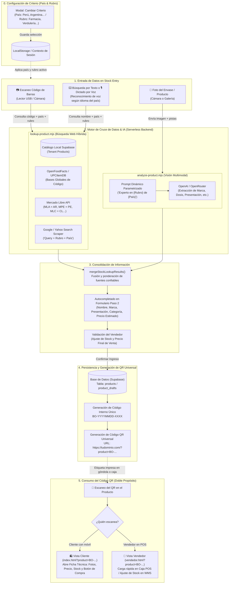

# Arquitectura y Cruce de Datos: Ingreso de Producto con IA y Criterio Dinámico

Este documento detalla el flujo de información, cruce de datos, inferencia con IA y resolución de códigos QR para el módulo de ingreso de stock.

---

## 📊 Diagrama de Flujo General (Mermaid)

---

## 🔍 Detalle del Cruce de Datos por Capa

| Capa | Entrada | Lógica de Procesamiento | Salida Contextualizada |
| :--- | :--- | :--- | :--- |
| **0. Criterio** | Selección de País + Rubro | Persiste en `localStorage` y actualiza la interfaz. | Contexto activo: ej. `🇵🇪 Perú` + `💊 Farmacia`. |
| **1. Dictado / Texto** | Voz del vendedor | Usa `recognition.lang = 'es-PE'` para no forzar jerga argentina. | Transcripción limpia del nombre o código. |
| **2. Búsqueda Web** | Código o Nombre | Consulta Mercado Libre Perú (`MPE`) y agrega sufijo `"${query} farmacia Peru"`. | Precios en Soles (PEN), marcas peruanas, fichas técnicas locales. |
| **3. Análisis de Foto** | Imagen del envase | El modelo de IA recibe las directivas del rubro farmacéutico (principio activo, mg, laboratorio). | JSON estructurado con datos exactos del rubro. |
| **4. QR Universal** | Producto guardado | Crea enlace `/?product=BO-...` e imprime etiqueta térmica o visualiza en pantalla. | QR escaneable por clientes y empleados. |
