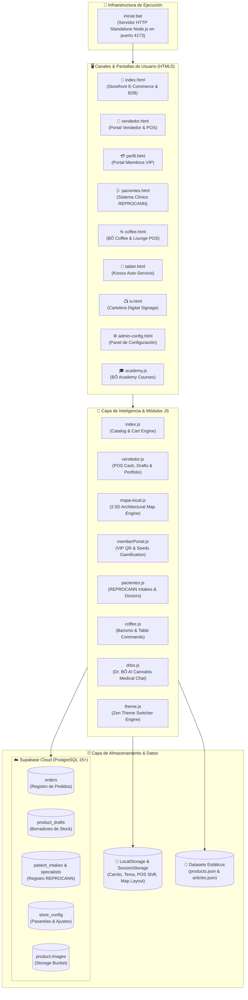
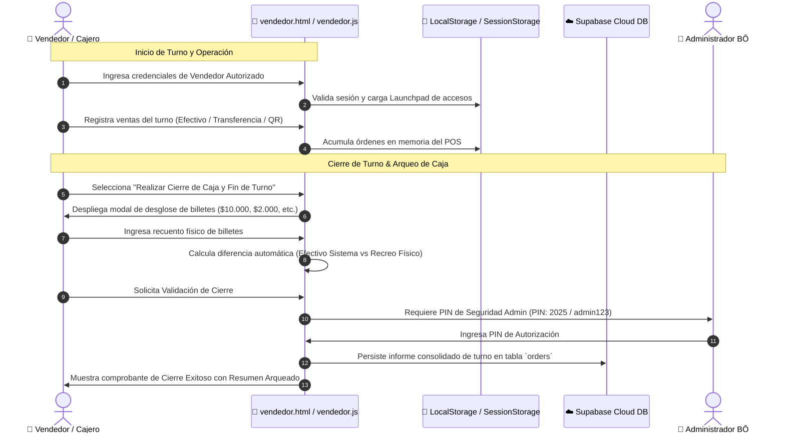
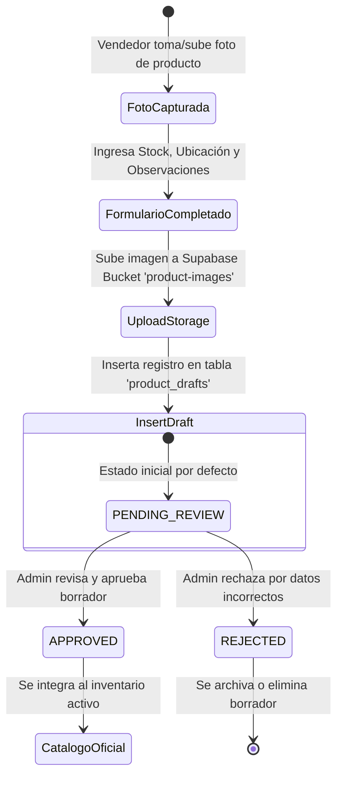
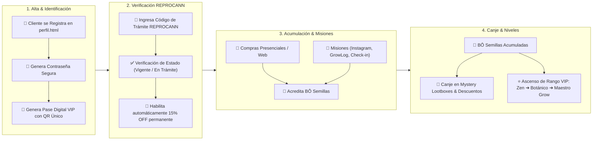

# 📐 BÔ GROW CLUB — DIAGRAMAS ARQUITECTÓNICOS Y FLUSJOS DEL SISTEMA

Este documento contiene los diagramas de arquitectura, flujos de datos, procesos de negocio y mapas de jerarquía del ecosistema **BÔ Grow Club**. Están diseñados en formato estándar **Mermaid** y **SmartArt Markdown** para ser interpretados por humanos y procesados por otros agentes de IA.

---

## 🏗️ 1. ARQUITECTURA GENERAL DEL ECOSISTEMA (Component Diagram)



---

## 🔄 2. FLUJO DE CARGA DE DATOS & FALLBACK OFFLINE-FIRST (Flowchart)

Este flujo garantiza que el catálogo siempre funcione, incluso si falla la conexión a internet o a Supabase.

```mermaid
flowchart TD
    A["🚀 Inicio de Carga de Aplicación (index.html)"] --> B["🔍 Intentar Fetch Local de products.json"]
    
    B -->|✅ Éxito (Respuesta OK)| C["📦 Cargar Catálogo Maestro desde JSON Estático"]
    B -->|❌ Fallo / Error CORS / Archivo No Encontrado| D["☁️ Activar Fallback: Consulta a Supabase API"]
    
    D -->|✅ Supabase Disponible| E["📦 Cargar Catálogo desde Tabla Supabase products"]
    D -->|❌ Sin Conexión| F["💾 Cargar Último Catálogo Cacheado en LocalStorage"]

    C --> G["🎨 Renderizar Grid de Productos & Categorías"]
    E --> G
    F --> G

    G --> H["📊 Ejecutar updateCategoryCounts() para Badges Ddinámicos"]
    H --> I["🔄 Inicializar Buscador & Filtros Facetados"]
```

---

## 🛒 3. FLUJO DE VENTA EN POS VENDEDOR & CIERRE DE CAJA (Sequence Diagram)



---

## 📸 4. FLUJO DE CARGA RÁPIDA DE STOCK & BORRADORES (State Diagram)

Diagrama de estados para la subida de productos por parte de vendedores sin riesgo de alterar el catálogo oficial sin aprobación.



---

## 🏬 5. MODELO JERÁRQUICO DE UBICACIÓN EN LOCAL (SmartArt Map)

Representación del modelo de coordenadas 3D de ubicación en el local:

```
[📍 SUCURSAL BÔ CENTRO]
 └── [📚 PISO DEL LOCAL]
      ├── Nivel 1 — Planta Baja
      ├── Nivel 2 — Entrepiso
      └── Nivel 3 — Depósito Alto
           └── [🏷️ ZONA DEL LOCAL]
                ├── Zona A: Vitrina Entrada / VIP (Dorado)
                ├── Zona B: Pasillo Botánico Central (Verde)
                ├── Zona C: Módulo Indoor Fondo (Azul)
                ├── Zona D: Depósito & Semillas (Púrpura)
                └── Zona E: Barra BÔ Coffee & Lounge (Ámbar)
                     └── [🗄️ ESTANTE / MUEBLE]
                          ├── A-1, A-2
                          ├── B-1, B-2
                          ├── C-1, C-2
                          ├── D-1, D-2
                          └── E-1, E-2
                               └── [📥 NIVEL INTERNO / BANDEJA]
                                    ├── Nivel 3 — Superior
                                    ├── Nivel 2 — Medio
                                    └── Nivel 1 — Inferior
```

---

## 💳 6. CICLO DE VIDA DEL CLIENTE VIP & REPROCANN (Activity Diagram)



---

## 🗺️ 7. MAPA DE NAVEGACIÓN Y ARCHIVOS HTML/JS (SmartArt Hierarchy)

```
[🌐 ECOSISTEMA BÔ GROW CLUB]
 │
 ├── 🛒 STOREFRONT PÚBLICO
 │    ├── index.html ───────── index.js + storefront.css (Catálogo, Buscador, Carrito)
 │    ├── theme.js ─────────── Controller Global Switcher Tema Zen (Claro/Oscuro)
 │    └── mercadopago-checkout.js ─ Integración con Pasarela de Pago
 │
 ├── 🏪 OPERACIÓN Y PUNTO DE VENTA (POS)
 │    ├── vendedor.html ────── vendedor.js (Launchpad, Cierre de Caja, Borradores)
 │    └── mapa-local.js ────── Engine del Mapa Arquitectónico 2.5D & Muebles
 │
 ├── 💳 CLUB VIP Y SALUD
 │    ├── perfil.html ──────── memberPortal.js (Pase Digital QR, Semillas, Misiones)
 │    └── pacientes.html ───── pacientes.js (Sistema de Intakes Médicos REPROCANN)
 │
 ├── ☕ EXPERIENCIA EN LOCAL
 │    ├── coffee.html ──────── coffee.js (POS Barismo, Comandera Mesa 1-20)
 │    ├── tablet.html ──────── tablet.js (Kiosco Auto-Servicio en Sala)
 │    └── tv.html ──────────── tv.js (Cartelera Digital Signage Promocional)
 │
 └── 🛠️ HERRAMIENTAS ADICIONALES
      ├── drbo.js ──────────── Asistente IA Médico Cannabis
      ├── academy.js ───────── BÔ Academy (Cursos & Artículos)
      ├── admin-config.html ── admin-config.js (Configuración Admin Supabase/MP)
      └── iniciar.bat ──────── Servidor Local Standalone Node.js en puerto 4173
```

---

*Documento técnico de diagramas arquitectónicos de BÔ Grow Club generado exitosamente.*
